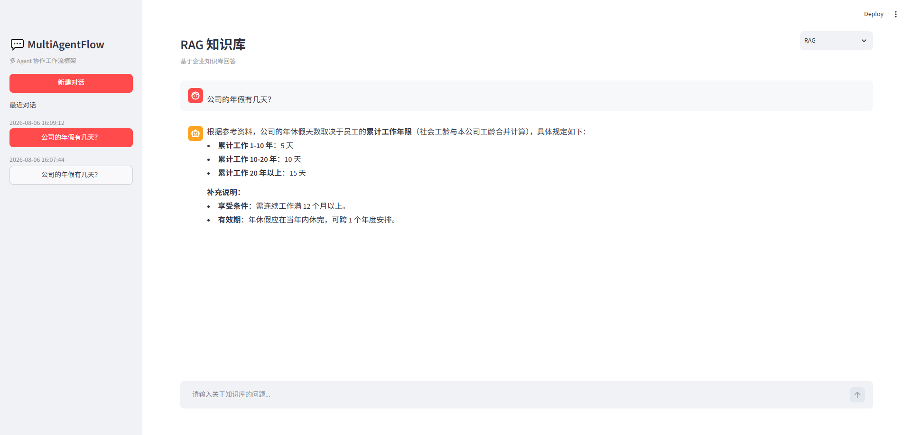
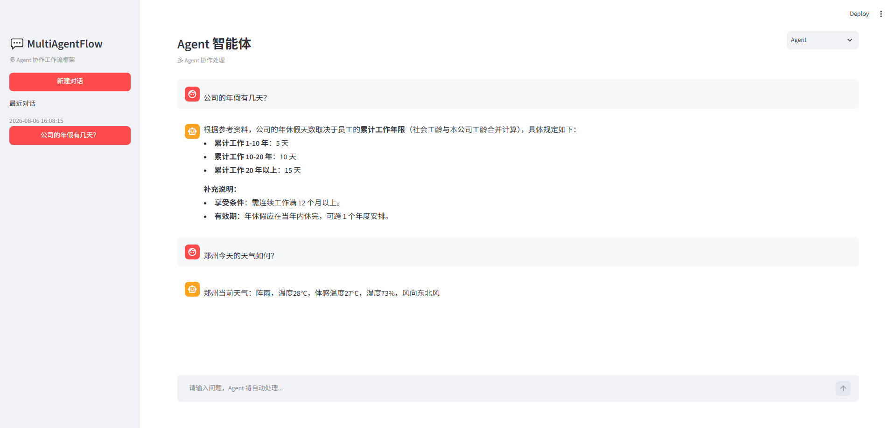

# MultiAgentFlow

<p align="center">
  
  
  
  
  
  
</p>

<p align="center">
  <strong>一个基于 Python + FastAPI + LangChain + LangGraph 的企业级多 Agent 协作框架</strong>
  <br/>
  集成 Chat（基础对话）、RAG（知识库检索）、Agent（智能体）、Skill（技能系统）、MCP（远程工具） 五大核心能力
</p>


## 目录

- [项目亮点](#项目亮点)
- [运行效果](#运行效果)
- [架构设计](#架构设计)
- [技术栈](#技术栈)
- [目录结构](#目录结构)
- [快速开始](#快速开始)
- [核心功能](#核心功能)
- [Docker部署](#Docker部署)
- [关于项目](#关于项目)

---

## 项目亮点
- **企业级架构设计**：采用经典的三层架构（API/Application/Infrastructure）与端口适配器模式，实现业务逻辑与基础设施解耦，代码结构清晰，易于维护和扩展。
- **现代化的 AI 技术栈**：基于 LangGraph 构建状态机式 Agent，支持意图识别、任务规划与多轮对话；集成 RAG 混合检索与重排序，解决大模型幻觉问题。
- **工程化最佳实践**：内置依赖注入、统一异常处理、速率限制、链路追踪及 Docker 容器化部署，具备生产环境交付能力。
可扩展技能系统：设计基于 Markdown 定义的 Skill 系统，支持渐进式披露与按需加载，实现 Agent 能力的动态扩展。

### 项目特性
- 💬 **智能对话** - 支持同步/流式对话，多轮上下文记忆
- 📚 **RAG 知识库** - 混合检索（向量 + BM25），重排序检索，引用来源溯源
- 🤖 **Agent 智能体** - 基于 LangGraph 的意图识别、任务规划、技能调用、工具调用、上下文摘要、人工干预确认等
- 🧠 **Skill 技能系统** - SKILL.md 文件定义，渐进式披露，按需加载技能   
- 🔌 **MCP 远程工具** - 通过 MCP 协议调用远程服务工具，动态扩展 Agent 能力
- 🔌 **多模型支持** - 阿里云/豆包等主流 LLM，启动时可切换
- 🛡️ **生产就绪** - CORS、认证、速率限制、日志、异常处理
- 📊 **链路追踪** - 集成 LangSmith，可进行链路追踪并观测
- 🐳 **容器化** - Docker + docker-compose 一键部署

---

## 运行效果
<div align="center">
    
    
</div>

---

## 架构设计

项目采用三层架构，职责清晰，易于扩展：

<div align="center">
    
</div>


| 层级 | 职责 | 核心组件 |
|------|------|---------|
| **API 层** | 对外暴露 RESTful 接口，处理请求/响应、参数校验、中间件 | routers、schemas、middleware |
| **Application 层** | 核心业务逻辑，编排 Service、Agent、Skill，定义端口接口 | service、agents、skills、ports、dependency_injection |
| **Infrastructure 层** | 封装外部依赖（LLM、向量库、MCP、文档处理、存储等） | adapter、document、retriever、storage、prompt、external |

---

## 技术栈

| 分类 | 技术 | 版本 | 说明 |
|------|------|------|------|
| Web 框架 | FastAPI | 0.139+ | 高性能异步框架 |
| LLM 框架 | LangChain | 1.3+ | LLM 应用开发框架 |
| Agent 框架 | LangGraph | 1.2+ | 状态机式 Agent |
| 向量数据库 | Chroma | 1.5+ | 轻量级向量存储 |
| 数据库 | SQLite | - | 会话持久化 |
| ORM | SQLAlchemy | 2.0+ | ORM 框架，数据持久化 |
| 配置管理 | Pydantic Settings | 2.14+ | 类型安全配置管理 |
| 链路追踪 | LangSmith | 0.9+ | LLM 应用可观测性 |
| 部署 | Docker | - | 容器化部署 |

---

## 目录结构

```
llm-starter/
├── api/                              # API 层
│   ├── main.py                       # FastAPI 入口
│   ├── middleware/                   # 中间件
│   │   ├── auth.py                   # 认证中间件
│   │   └── rate_limit.py             # 速率限制中间件
│   ├── routers/                      # 路由
│   │   ├── chat.py                   # 对话接口
│   │   ├── rag.py                    # RAG 接口
│   │   ├── agent.py                  # Agent 接口
│   │   └── session.py                # 会话接口
│   ├── schemas/                      # 请求/响应模型
│       ├── chat.py                   # Chat 模型
│       ├── rag.py                    # RAG 模型
│       ├── session.py                # 会话 模型
│       └── agent.py                  # Agent 模型
├── application/                      # 业务层
│   ├── agents/                       # Agent 实现
│   │   ├── flow_agent.py             # 带意图识别的流程 Agent
│   │   └── simple_agent.py           # 简单工具调用 Agent
│   ├── ports/                        # 端口（接口定义）
│   │   ├── llm_client_port.py        # LLM 客户端端口
│   │   ├── document_port.py          # 文档处理端口
│   │   ├── prompt_port.py            # Prompt 端口
│   │   ├── retriever_port.py         # 检索器端口
│   │   └── vector_store_port.py      # 向量存储端口
│   ├── service/                      # 服务
│   │   ├── chat_service.py           # 对话服务
│   │   ├── rag_service.py            # RAG 服务
│   │   └── agent_service.py          # Agent 服务
│   ├── skills/                       # Skill 技能系统
│   │   ├── base_skill.py             # Skill 基类 + SkillManager
│   │   ├── SKILL.md                  # 技能定义规范
│   │   ├── weather/                  # 天气技能目录
│   │   │   └── SKILL.md              # 天气技能定义
│   │   └── weather_skill.py          # 天气技能实现
│   ├── tools/                        # 工具实现
│   │   ├── calculator.py             # 计算器
│   │   ├── time_tool.py              # 时间查询
│   │   └── weather.py                # 天气查询
│   ├── middleware/                   # 中间件
│   │   ├── custom_middleware.py      # 自定义中间件
│   │   └── wrap_middleware.py        # 包装中间件
│   └── dependency_injection.py       # 依赖注入容器
├── infra/                            # 基础设施层
│   ├── adapter/                      # 适配器
│   │   ├── openai_adapter.py         # LLM 适配器
│   │   ├── chroma_adapter.py         # Chroma 适配器
│   │   └── mcp_adapter.py            # MCP 远程工具适配器
│   ├── document/                     # 文档处理
│   │   ├── loader.py                 # 文档加载
│   │   ├── cleaner.py                # 文档清洗
│   │   ├── splitter.py               # 文档切分
│   │   └── formatter.py              # 文档格式化
│   ├── retriever/                    # 检索器
│   │   └── retriever.py              # 混合/重排序检索
│   ├── storage/                      # 存储
│   │   ├── database.py               # 数据库连接
│   │   ├── models.py                 # 数据模型
│   │   └── session_storage.py        # 会话存储
│   ├── prompt/                       # Prompt 管理
│   │   ├── prompt_manager.py         # Prompt 管理器
│   │   └── template/                 # Prompt 模板
│   ├── external/                     # 外部服务
│   │   └── weather_client.py         # 天气 API 客户端
│   ├── utils/                        # 工具类
│   │   ├── log_util.py               # 日志工具
│   │   ├── file_util.py              # 文件工具类
│   │   └── str_util.py               # 字符串工具类
│   ├── settings.py                   # 配置管理
│   └── exceptions.py                 # 自定义异常
├── docs/                             # 知识库文档
├── chroma_db/                        # 向量数据库存储
├── sqlite_db/                        # SQLite 数据库存储
├── logs/                             # 日志目录
├── .env                              # 环境变量
├── requirements.txt                  # 依赖列表
├── Dockerfile                        # Docker 配置
├── docker-compose.yml                # Docker Compose 配置
└── README.md                         # 项目说明
```

---

## 快速开始

### 环境要求

- Python 3.10+
- pip
- (可选) Docker Desktop

### 1. 克隆代码

```bash
git clone https://github.com/long0115/llm-starter.git
cd llm-starter
```

### 2. 创建虚拟环境

```bash
# Windows
python -m venv .venv
.venv\Scripts\activate

# Linux/Mac
python -m venv .venv
source .venv/bin/activate
```

### 3. 安装依赖

```bash
pip install -r requirements.txt
```

### 4. 配置环境变量

在 `.env` 文件中配置：

```env
# 选择默认模型提供商
DEFAULT_LLM_PROVIDER=aliyun

# 阿里云配置
ALIYUN_API_KEY=your-api-key
ALIYUN_BASE_URL=https://dashscope.aliyuncs.com/compatible-mode/v1
ALIYUN_CHAT_MODEL=qwen3.7-plus
ALIYUN_EMBEDDING_MODEL=text-embedding-v4

# 豆包配置（可选）
DOUBAO_API_KEY=your-api-key
DOUBAO_BASE_URL=https://ark.cn-beijing.volces.com/api/v3
DOUBAO_CHAT_MODEL=doubao-seed-2-1-pro-260628
DOUBAO_EMBEDDING_MODEL=text-embedding-v4

# LangSmith 配置（可选，用于链路追踪）
LANGSMITH_API_KEY=your-langsmith-key
LANGSMITH_TRACING=true
LANGSMITH_PROJECT=my-llm-app
```

### 5. 启动服务

```bash
# 开发模式（支持热重载）
uvicorn api.main:app --host 0.0.0.0 --port 8000 --reload

# 生产模式
uvicorn api.main:app --host 0.0.0.0 --port 8000
```

### 6. 访问服务

- API 文档（Swagger）：http://localhost:8000/docs
- API 文档（ReDoc）：http://localhost:8000/redoc
- 健康检查：http://localhost:8000/health

### 7. 模型切换

修改 `.env` 中的 `DEFAULT_LLM_PROVIDER`：

```env
# 使用阿里云
DEFAULT_LLM_PROVIDER=aliyun

# 使用豆包
DEFAULT_LLM_PROVIDER=doubao
```

### 8. RAG 参数调优

在 `infra/settings.py` 中调整：

```python
# 检索参数
RAG_VECTOR_TOP_K: int = 10            # 向量检索返回数量
RAG_BM25_TOP_K: int = 10              # BM25 检索返回数量
RAG_RERANK_TOP_K: int = 3             # 重排序返回数量
RAG_HYBRID_WEIGHTS: List[float] = [0.6, 0.4]  # 混合权重
```

### 9. 速率限制

```python
RATE_LIMIT_MAX_REQUESTS: int = 60      # 最大请求数
RATE_LIMIT_WINDOW_SECONDS: int = 60    # 时间窗口（秒）
```

### 10. 数据持久化

以下目录会自动挂载到本地：

| 容器路径 | 本地路径 | 说明 |
|---------|---------|------|
| `/app/chroma_db` | `./chroma_db` | 向量数据库 |
| `/app/sqlite_db` | `./sqlite_db` | 会话数据库 |
| `/app/logs` | `./logs` | 日志文件 |
| `/app/docs` | `./docs` | 知识库文档 |

---

## 核心功能

### 1. 智能对话

支持同步和流式两种对话模式，通过 `session_id` 实现多轮上下文记忆：

### 2. RAG 知识库

文档入库流程：

```
用户上传文件 → 文档加载 → 内容清洗 → 文本切分 → 向量化 → 存储到 Chroma
```

查询流程：

```
用户问题 → 问题改写 → 混合检索（向量 + BM25） → 重排序（可选）→ LLM 生成 → 返回引用来源
```

### 3. Agent 智能体

基于 LangGraph 构建的 Agent，支持：

- **意图识别**：根据用户问题判断其意图，然后决定是否调用技能、工具或路由到其他智能体
- **任务规划**：自动拆解复杂任务，根据意图选择合适的技能或工具
- **人工干预**：执行高危任务时，需要人工确认或干预
- **工具调用**：计算器、时间查询、天气查询
- **对话记忆**：基于线程的多轮对话

### 4. Skill 技能系统

采用 SKILL.md 文件定义方式（知识驱动型），支持渐进式披露：

- **启动时**：只加载所有 SKILL.md 的 YAML frontmatter（name + description），约几百 token
- **匹配后**：按需加载完整 SKILL.md 内容（执行步骤、注意事项等）
- **执行时**：调用具体 Python 实现

### 5. MCP 远程工具

通过 MCP（Model Context Protocol）协议调用远程服务工具：

- **动态扩展**：不修改代码，通过配置新增 MCP 服务即可扩展 Agent 能力
- **异步管理**：支持异步上下文管理，正确管理连接生命周期
- **降级处理**：MCP 服务不可用时自动降级为本地工具

---

## Docker部署

### 1. 构建镜像

```bash
docker-compose build
```

### 2. 启动服务

```bash
docker-compose up -d
```

### 3. 查看日志

```bash
docker-compose logs -f
```

### 4. 停止服务

```bash
docker-compose down
```

---

## 关于项目
本项目由一名拥有 10 年经验的 Java 后端工程师开发。旨在探索如何将企业级后端工程化经验（如分层架构、设计模式、依赖注入）应用到 Python AI 应用开发中，解决 AI 项目常见的“脚本化”、“难以维护”等痛点。